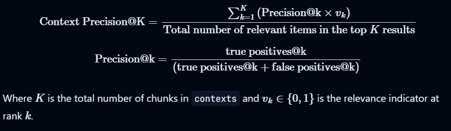
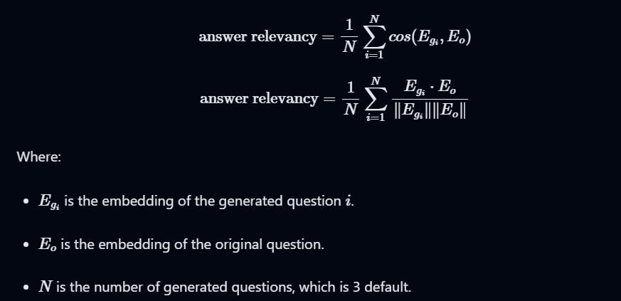

# Journal of the development of this project

## Part 1: Getting the data

### Download important pdfs, or get them from the documentations

### The Web scraper with BeautifulSoup to get the data on the Irise website on important information

#### 5/29/2024

- Started the webscraper
- Define what urls we will scraped based on the information they have
- Set all urls in one dictionary to scrape them all at once in the same format
- Run into Headers issue to acces subsequent pages: solved it using the Microsoft edge headers
- Set headers for Mozzilla, chrome, safari, edge and android so the scapper works with all of them using their respective user agent.
- Got rid of the scripts and css styles to get only the texts
  code:code:```
  #Remove script and style elements

  for script_or_style in soup(['script', 'style']):
  script_or_style.decompose()

  ```

  ```
- Get the text element along with their links so the chatbot can always provide links in support of the answers that the user can go to.

#### 5/30/2024

- I got some of the pdfs and got the webscrapper to work, Next I will save the documents as json files
  they have the title but should we

#### 5/31/2024

- Finally getting the Json file to be assemble,
- Issues:
  1-choosing the browser iterating over the browsers dict.

  - I set it up so we have a function that choose the user agent base on the broswer we specify and the code, would be probably good to just establish, chrome or edge

  2- saving the text after each element to just add the next itereration to it

  3- iterating over each url in URLs
- LESSONS LEARNED

  - webscraping with beautiful soup
  - Navigate HTML trees: tags, elements, descendants, scripts and styles etc..
  - Headers and user agents
  - generate json files
  - Use github better
  - create a dev journal
  - work better with path and files management

  #### 6/2/2024

  Creating a folder for the pdfs
  and starting to work on the master json


  - first it will be necessary to change the pdf files into json
    -and then consolidate all the files into one json

  Learning to work with pydf

  6/4/2024
  Learned about embeddings and how the embeddigs models are created
  from one hot encoding to Hierachical Softmax

  #### 6/5/2024

  Pull request using GIT PULL

  too long names in github can't pull

  conflict in github
  After resolving the conflicts, use git add `<resolved-file>` to stage the changes, and then commit to complete the merge1.

  Instead of a regular git pull, consider using git pull --rebase. This option fetches the latest changes from the remote branch and applies your local changes on top of them.
  The advantage is that it avoids creating a merge commit, keeping your changes linear. However, you’ll still need to resolve any merge conflicts that arise.
  To set this as your default behavior for git pull, run: git config --global pull.rebase true1.

  clean repository tree

  #### 6/6/2024

  Experimented with emmbeddings from Hugginface using an api

  Code example:

```
api_url = f"https://api-inference.huggingface.co/pipeline/feature-extraction/{model_id}"
headers = {"Authorization": f"Bearer {hf_token}"}
def query(texts):
    response = requests.post(api_url, headers=headers, json={"inputs": texts, "options":{"wait_for_model":True}})
    return response.json()

texts = ["How do I get a replacement Medicare card?",
        "What is the monthly premium for Medicare Part B?",
        "How do I terminate my Medicare Part B (medical insurance)?",
        "How do I sign up for Medicare?",
        "Can I sign up for Medicare Part B if I am working and have health insurance through an employer?",
        "How do I sign up for Medicare Part B if I already have Part A?",
        "What are Medicare late enrollment penalties?",
        "What is Medicare and who can get it?",
        "How can I get help with my Medicare Part A and Part B premiums?",
        "What are the different parts of Medicare?",
        "Will my Medicare premiums be higher because of my higher income?",
        "What is TRICARE ?",
        "Should I sign up for Medicare Part B if I have Veterans' Benefits?"]

output = query(texts)

import pandas as pd
embeddings = pd.DataFrame(output)

embeddings
```

#### 6/7/2024

- Worked on the master json file
- learned the difference between json.extend and json.append

#### 6/8/2024

- create the file embeddings.py
- pass the code from the note book to create the embeddings function

#### 6/9/2024

- Mongo db Is not free even in shared

#### 6/17/2024

- An introduction to langchain
- get to know chromadB it seems to be free
- Data cleaning and preprocessing for LLMS

### 6/18/2024

- Course on Deep learning AI for techniques to get better retrieval

### 6/19/2024

- implementation of some of the techiques, started to get better results
- query expansion with example of aswers and similar questions

### 6/24/2024

- jus planned the next day

### 6/25/2024

coding RAG and necesarry steps out of jupyter

- PLAN

  MASTER FILE LOADER FUNC

  - loading the master json into a text file list
  - converting the list in only text
  - Cleanning the text: unicodes, normalized spaces, replace html codes

    TEXT WRAPER FUNC
  - wrap the ext to make it

    Langchain
    TEXT SPLITTER FUNC
  - Use  langchain.text_splitter import RecursiveCharacterTextSplitter, SentenceTransformersTokenTextSplitter to creare the chunks
  - first recursicve character splitter chunk size =8000, over lap =1000

    - RecursiveCharacterTextSplitter: split in the specified character
    - recursively until we got the size of chunks

    sentenceTransformersTokenTextSplitter: split chunk into a number of token

    ChromaDB
    ChromaDB_loader func
  - Call the embedding function to create embedding from chromadb
  - use chromadb persistent client to put the vector database temporarily o local machines --create chroma client
  - create collection if not exist
  - indexed them the chunks
  - add them to collection
    -and count them to verify

    documents Retriever func
  - call chroma_client get collection to load it when run
  - defined the query input zone
  - query the chroma collection defining the number of results to get
  - get documents from results
  - Change retrieved documents to string with the list_2_string function

  OPENAI
  OPENAI connector func
- define openai client
  query

  Query expansion
  Query expansor
  *pass the query to gpt without the rag and ask it to generate an example of answer, implement guardrails and constraints
  *join the generated answerwith our prompt for an augmented prompt

  multiple query augmenter

  *from this augmented prompt pass it to gpt again and ask for more(5) additional questions related to the original query
  *join the ouput with the augmented query and this will be the final query to pass through the RAG
  query

  RAG_func
- deine the rag function

  - put the information available from the retrieve documents and pass the query
  - define the main prompts with constraints and guardrails
  - call reponse and return it, this the answer

  We will probalbly implement embedding adaptor later on

### 6/25/2024

organizing folders

- data adquisicion

  - scrapping
  - pdfs
  - to master json
- Data preprocessing

  - cleaning master_json
  - to loading in chroma
- query preprocessing

  - query expansor
  - multiple query augmenter

* RAG_inference
  - calling RAG function for inference

### 6/28/2024

- finding the root directory
  `return os.path.dirname(os.path.abspath(os.curdir))`
  import modules anywhere
  `sys.path.append(os.path.abspath(os.path.join(os.path.dirname(os.path.abspath(__file__)), '../../src')))`

  finished the Data preprocessor

### 6/29/2024

  Completed the query procesor

### 6/30/2024

    Retriever And RAG pipeline

### 7/6/2024

- debugging the retrieval process
- in data preprocessing.py took the creation of the client out of the codition of checking the master json existence
- In Rag pipeline, recall the persistent client with the define path, feed the final query not as a
  list but just string
  -query preprocesor, changed the generated questions from the query to 2 and the expanded query hypo
  thetical answer to 2 phrases, because we were exceeding the tokens limits of the models

#### 9/14/2024

- I have been working on the project but I haven't kept up with the dev journal

Changes in the last period apart from taking a pause for some time includes:

- creating a main.py script where I execute Rag process using functionin other script.
  this was done because i was having problems to run to connect multiple jobs like an inference and evaluatin separately when the functions
  are called in the same script they're defined

# evaluation(quantitative)

- created a RAGAS pipeline evaluating the retriever and the generator part of our rag system, including enriching the RAG system
  METRICS:

  - context_precision', 'context_recall', 'faithfulness', 'answer_relevancy

  WHY?

  To evaluate : retriever part (context metrixcs) and generator part (faithfulness and answer relevancy)

  Context precision [0,1]: if all of theground-truth items present in the contexts are ranked higher (computed using the question, ground_truth and contexts)

  

  Context recall[0,1]: Context recall measures the extent to which the retrieved context aligns with the ground truth,(computed using the question, ground_truth and contexts)
  

  Answer Relevance [0,1]: How pertinent the given answer is to the given prompt(question by the user, A lower score is assigned to answers that are incomplete or contain redundant) does not consider factuality but penalizes cases where the answer lacks completeness or redundant details, to compare groundtruh answer to generated answer, answer correctness. we didn't add it to our pipeline but we will, I'm also thinking about bias and fairness.

  (calculated using question, Context, Answer)

  

  faithfulness: This measures the factual consistency of the generated answer against the given context. It is calculated from answer and retrieved context. The answer is scaled to (0,1) range. Higher the better.
  


# jan 3rd 2025, going at it again

## problem we are haveing to solve
  0- initial deployement with streamlit just to see how it goes
  1- stop using API and use a model in house, llama can be a good choice
  2- start with the model and rag same architecture and finetune if necessary
  3- evaluate questions remebering past question in one conversation, we will not save conversation
  4- 

## streamlit up.


# Refactoring  plan:

Data adquisition:
MONGODB
  Pdf - try pymupdff4llm instead of pypdf
  web scrapping, schedule it to happen every month on the 1st
  store json from web in data base
  
Data transformation pipeline: "to be trigered with new data loaded in the database (use airflow)
  Join Jsons scrapped and PDFs to create a corpus
  Data cleaning
  Langchain preprocessing (charc splitter aand token splitter )
  Embeddings creation
  load data in chroma

Query preprocessing pipeline:
  Query expansion,
  Cross encoder reranking,

  RAG pipeline:


EValuation:

RAGAS

  - evaluate cost
  - explore other approach as inspect or deepval


Front end 
  Streamlit: 
    chatting and displaying performace metrics
    cost

I don't want to store al the question and results:
  define how to save the results: by class, by number say 100 result randomly

  


